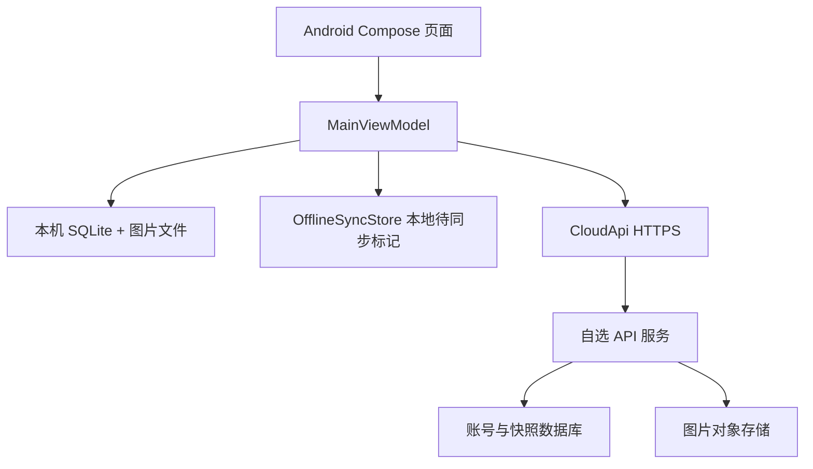

# 华农食堂项目交接文档

更新日期：2026-09-24。交接基线：GitHub `YueTsai2007/HuaNongCanteen` 的 `main`，提交 `d6aaa2f`（完整提交号以仓库为准）。本文件用于移交 Android 客户端、旧 Sites API、待部署的 Cloudflare Worker，以及迁移到接手人数据库的工作。

## 1. 先看结论

| 项目 | 当前状态 | 接手人应做的事 |
| --- | --- | --- |
| Android 客户端 | v0.5.0，原生 Kotlin + Jetpack Compose；GitHub Actions `assembleDebug` 曾成功，测试 APK 已产出 | 用自己的环境重新构建、真机验收，再签名发布 |
| 本地数据与离线模式 | SQLite 保存菜单、购物车和订单；有手动 ZIP/CSV 导出，离线入口和待同步标记 | 验证断网、重连、冲突、卸载重装的完整流程 |
| 当前 APK 的云 API | 构建默认值仍为旧 Sites 域名 `https://huanong-canteen-api.martiansztu2007.chatgpt.site` | 改成新服务域名并重建 APK；现有测试 APK 不会自动切换 |
| 旧 Sites 服务 | `site-source/` 是另一套 API 源码，在独立的 Sites 工程中 | 如要迁移旧用户，先确认旧服务可用及数据访问权限，导出后再退役 |
| Cloudflare Worker | `cloud-api-worker/` 已写好兼容 API、D1 迁移和 R2 图片接口；类型检查、部署 dry-run、本地迁移通过 | **尚未在 Cloudflare 账号完成实际部署或远程迁移** |
| 原拟使用的 D1 | `huanong`，ID `afd8d1e9-8a26-4a10-ab2c-6144ac991cb7`，只写入 Wrangler 配置 | 用户现改用他人数据库；先替换配置，别误连原 ID |
| NDK | **尚无 NDK/JNI/C++ 代码**；当前菜单/金额计算由 Kotlin/SQLite 实现 | 若确有可测的计算热点，再独立引入 NDK 模块；不要把当前版本描述成 NDK 实现 |

**部署状态必须按此表沟通**：Worker 构建通过不等于远程 D1 已应用迁移；Android 编译通过不等于注册、同步、图片恢复已在新服务器端到端通过。

## 2. 仓库、结构与入口

- Android 源码仓库：[YueTsai2007/HuaNongCanteen](https://github.com/YueTsai2007/HuaNongCanteen)。当前 GitHub 仓库为公开可见；交接人应由仓库所有者授予必要的协作权限，不转交个人登录凭证。
- `app/src/main/java/cn/huanong/canteen/MainActivity.kt`：Compose 页面、导航、图片选择与预览、文件导入导出、网络回调。
- `app/src/main/java/cn/huanong/canteen/ui/MainViewModel.kt`：页面状态、业务操作、离线模式、账号和同步冲突处理。
- `app/src/main/java/cn/huanong/canteen/data/MenuRepository.kt`：SQLite、订单记录和统计、CSV/ZIP 导入导出、云端快照转换。
- `app/src/main/java/cn/huanong/canteen/data/Models.kt`：菜单、店铺、菜品、购物车和订单模型。
- `app/src/main/java/cn/huanong/canteen/data/CloudApi.kt`：HTTP 协议、令牌存储和服务地址；`OfflineSyncStore.kt`：按账号记录本地修改代次、云端修订号和离线标记。
- `app/build.gradle.kts`：Android 配置和 `cloudApiBase`/`siteGateToken` 构建属性；`app/src/main/AndroidManifest.xml`：网络权限、系统备份配置。
- `cloud-api-worker/src/index.ts`：拟迁移的 Worker API；`cloud-api-worker/migrations/0001_initial.sql`：D1 表结构；`cloud-api-worker/wrangler.jsonc`：D1/R2 绑定；`cloud-api-worker/README.md`：部署步骤。
- `.github/workflows/android-build.yml`：JDK 17、SDK 36 的 debug 构建；目前只上传短期构建 artifact，不自动生成正式 Release。
- 旧 Sites 项目源码在原工作区的 `site-source/`，**并不包含在本 GitHub Android 仓库中**。需要延续旧服务时，由原管理者单独交付 Sites 工程/访问权限。

## 3. 功能范围和数据流

### 客户端已有功能

- 左列入口：荷园、芷园、莘园、西园、稻香园、绿榕园、小吃街、外卖；可添加店铺名称、说明和图片；可添加菜品分类、名称、说明、价格和图片。
- 店铺详情、菜品选择、购物车数量、结算金额、订单归档；订单按全部/近 7 天/近 30 天浏览，查看明细和统计；订单导出 CSV。
- 店铺图片预览、页面与购物车动画；菜单数据和图片导出 ZIP、从 ZIP 导入。
- 邮箱密码注册/登录界面、免登录“先离线使用”；已登录用户断网可继续用本机数据，重连尝试同步。

### 本地与远程存储



- 价格和订单总额用**整数分**计算。订单行保存下单时的店名、菜名、单价、数量、备注；店铺或菜品后续更名不应改写历史订单。
- SQLite 文件名 `huanong_canteen.db`，当前数据库版本 4；主要表 `halls`、`shops`、`dishes`、`cart`、`orders`、`order_lines`。图片在私有目录 `menu-images/`。
- 本地 ZIP 含数据库和 `menu-images/`；订单 CSV 是便于阅读的导出表，**不代替可恢复备份**。导入 ZIP 是替换本地数据，操作前先另存一份备份。
- 云端 `user_state` 目前每个账号保存一个 JSON 快照（`schemaVersion: 1`；数组键 `halls`、`shops`、`dishes`、`cart`、`orders`），订单行嵌套在订单中；图片字节独立存入对象存储，快照只保存 `imageId`。
- 当前同步是**整份快照替换**，并非逐条合并。客户端上传时先传图片，再以修订号 `revision` 作为乐观锁写快照；远端已更新会收到 409，用户需选“保留本机”或“使用云端”。选择后者会覆盖当前本机数据，建议先导出 ZIP。
- 本机未同步代次在 SharedPreferences `cloud_sync_state`，令牌通过 Android Keystore AES-GCM 加密后存于 `cloud_session`。登录状态、待同步标记和 SQLite 数据要作为一个整体考虑。

## 4. 接手人数据库的两种接法

### A. 继续采用 Cloudflare Worker + D1 + R2

此方案改动最少：在接手人的 Cloudflare 账号创建 D1 和用于图片的 R2 bucket；将 `cloud-api-worker/wrangler.jsonc` 中 `database_name`、`database_id`、`bucket_name` 改为**新资源的实际值**。原 ID 是用户先前提供的配置，不能拿它当作接手人账号的资源。确认绑定 `DB`、`BUCKET` 与 Worker `Env` 一致。

在 `cloud-api-worker/` 中使用 Node.js >=22.13：

```bash
npm install
npm run typecheck
npm run db:migrate
npx wrangler deploy
```

`npm run db:migrate` 是**远程 D1 迁移**，执行前检查登录的是目标 Cloudflare 账号、配置指向目标数据库，并做好备份。也可按 `cloud-api-worker/README.md` 使用 `npm run deploy` 连续执行迁移和部署。先创建 R2 bucket，再部署 Worker。最后访问 `https://<实际 Worker 域名>/api/v1/health`，确认返回 `{"ok":true,"database":"connected"}`。健康检查仅检测 D1，**不代表 R2、注册或同步也正常**。

### B. 使用接手人的其他数据库/服务

Android 不直接连接数据库；由接手人提供 HTTPS API。可保留 `CloudApi.kt` 协议，替换 `cloud-api-worker/` 的 D1/R2 存储实现。关系型数据库建议沿用 `users`、`sessions`、`user_state`、`auth_rate_limits` 语义；图片可用独立对象存储，但 `imageId` 的账号隔离和下载/上传路径要一致。若服务已有账号系统，应设计旧账号迁移、ID 对照和会话切换，不要只改数据库连接串。

两种接法均必须满足如下最低协议（JSON 均为 UTF-8，登录后请求带 `Authorization: Bearer <token>`）：

| 方法与路径 | 请求/响应要点 | 关键约束 |
| --- | --- | --- |
| `GET /api/v1/health` | `{"ok":true,"database":"connected"}` | 只用于基础连通性 |
| `POST /api/v1/auth/register` | `{"email":"…","password":"…"}` → `{"account":{"id":"…","email":"…"},"token":"…","expiresAt":毫秒时间戳}` | 邮箱唯一，密码服务器端加盐哈希；重复邮箱 409 |
| `POST /api/v1/auth/login` | 同上 → 同上 | 错误密码 401，限流 429 |
| `GET /api/v1/auth/me` | → `{"account":{"id":"…","email":"…"}}` | 令牌失效 401；客户端会进入离线状态 |
| `POST /api/v1/auth/logout` | → `{"ok":true}` | 服务端撤销令牌；客户端还会清除本机当前账号数据 |
| `GET /api/v1/state` | → `{"revision":整数,"payload":对象或 null,"updatedAt":毫秒时间戳或 null}` | 每个账号单独存储 |
| `PUT /api/v1/state` | `{"revision":整数,"payload":快照对象}` → `{"revision":新整数,"updatedAt":毫秒时间戳}` | 只在修订号吻合时原子更新，否则 409；快照上限约 1 MB |
| `POST /api/v1/images` | 原始 JPEG/PNG/WebP 字节 → `{"imageId":"…"}` | 图片上限 5 MiB、关联当前账号 |
| `GET /api/v1/images?id=<imageId>` | → 原始图片字节 | 必须检查图片归属账号，禁止跨账号读取 |

服务端源文件是上述接口细节的最终依据。原 Worker 的会话有效期 30 天、PBKDF2-SHA256、按 IP+邮箱的登录/注册限流，以及 `users/sessions/user_state/auth_rate_limits` 四表均见源码。新服务若更改字段或状态码，应同步改 `CloudApi.kt`、同步逻辑及自动化测试。

### 绑定新 API 与重编译

修改 `app/build.gradle.kts` 的 `cloudApiBase` 默认值，或构建时传入：

```bash
./gradlew :app:assembleDebug -PcloudApiBase=https://<实际 API 域名>
```

若使用独立的非 Sites API，`siteGateToken` 留空即可。旧 `SITE_GATE_TOKEN`/`OAI-Sites-Authorization` 是旧 Sites 外层访问机制，不是新服务的账户凭证。构建后确认包中生效的是新 URL，旧 APK 不会自动更新；正式发布还需专用签名密钥和相同 `applicationId` 的升级路径。

## 5. 从旧服务/旧设备迁移数据

1. **先盘点**：旧 Sites 服务是否有实际用户数据；旧 D1 `huanong` 是否真的建立了表和记录；用户手机上是否有未同步的本地修改。不要把“配置中有 D1 ID”误认为数据已在 D1。
2. **最稳妥的用户级迁移**：每位用户在旧版应用中导出菜单 ZIP（含数据库、图片、订单），保存到独立位置；新服务创建账号，在新版应用导入 ZIP，联网同步，换第二台设备登录核验店铺、菜品、图片、订单。订单 CSV 可另导出用于人工核对。
3. **服务器级迁移**：如必须保留原账号登录，需在有合法访问权限的前提下搬迁 `users` 的密码盐/哈希、`user_state`、相应图片对象；必要时用 ID 映射处理账号归属。旧服务和新服务的哈希算法、字段格式、图片键都要逐一核对。通常不建议搬迁现有 session：新服务让用户重新登录更可控。
4. **冲突时**：先从旧设备导出 ZIP，记录两端数据量和修订号，再决定保留哪份。当前产品不支持自动合并两台设备上各自新增的店铺/订单；覆盖前不要卸载旧版。
5. **下线旧服务前**：抽样核验多账号、多设备及图片下载；保存可恢复备份和回滚方案。旧服务是否已有数据尚未在这次交接中验证。

## 6. 已做的验证与尚缺的验收

| 验证 | 结果/边界 |
| --- | --- |
| GitHub Actions Android 构建 | 2026-09-24 的运行 `36002431830` 成功，生成 v0.5.0 debug APK；只能证明该配置下可编译 |
| Worker TypeScript | `tsc --noEmit` 成功 |
| Wrangler 配置 | `wrangler deploy --dry-run` 成功，显示 D1/R2 绑定；未真实部署 |
| D1 SQL | 本地迁移成功，创建四张表；**未对远程 D1 执行迁移** |
| Worker 本地 HTTP 运行 | 执行环境网络接口报错，未跑通本地服务；不能视作接口通过 |
| 新服务端到端 | 注册、登录、图片、离线同步、冲突与旧数据迁移均**未在目标数据库上验证** |

曾生成的测试包：`app-debug.apk`，SHA-256 `a80475bc7251355ed0ba00ebb672cac7f457625b58681a2a709bb730e9691158`。该包按构建默认值指向旧 Sites API，只适合验证 UI 和本地离线流程。Actions artifact 保留 14 天；正式交付应另行构建和签名，不应把 debug APK 当正式发行包。

## 7. 优先待办清单（按顺序）

### P0：交接与数据安全

- [ ] 明确接手人使用的服务器、数据库、图片对象存储及其管理者；取得新服务域名和必要的最小权限。
- [ ] 盘点旧 Sites 是否存在真实用户数据、旧 D1 是否有记录；在迁移前导出可恢复备份，记录账号及图片数量。
- [ ] 使用自己的数据库/存储资源替换 Wrangler 绑定或实现兼容 API；不要使用旧 D1 ID 冒充目标资源。
- [ ] 部署并验收 `/health`、注册、登录、`/me`、`/state` 修订号 409 冲突、图片上传下载和跨账号隔离。
- [ ] 确定数据迁移策略，确保店铺、菜品、图片、订单档案和账号归属都能恢复。
- [ ] 更新 Android API 地址，重编译；以真机完成从注册到第二台设备同步的一轮完整验收。

### P1：离线、备份与发布

- [ ] 用飞行模式测试新建店铺、添加图片/菜品、下单、查询统计、导出；恢复网络后检查服务端及第二台设备。
- [ ] 测试两设备同时离线编辑造成的 409，验证两个按钮和导出 ZIP 后恢复流程，避免默默覆盖订单。
- [ ] 测试卸载重装：手动 ZIP 导入是否完整，云端登录是否能恢复；系统自动备份须按不同设备/系统单独验证，不能保证每次都会触发。
- [ ] 检查账号切换时共用 SQLite 的隔离策略；`logout()` 会清理本机菜单/订单，必须确认云端已同步并提醒用户导出备份。
- [ ] 检查本地同步代次存于 SharedPreferences 的耐久性、备份恢复后的令牌/修订号状态；必要时改为与 SQLite 同事务记录，避免数据库与同步标记分离。
- [ ] 配置正式签名、版本号、CI Release 流程；做升级安装测试，发布对应源码提交号和 APK 校验值。

### P2：扩展和质量

- [ ] 当前快照是整包上传且有 1 MB 限制；订单增长后设计分页/增量同步、服务端迁移版本及图片生命周期清理。
- [ ] 添加单元与集成测试：金额整数计算、订单归档、快照往返、跨账号访问、修订号并发、ZIP 导入异常和断网重连。
- [ ] 评估 Android 目标 SDK 36 下的通知/文件选择、系统备份与各版本兼容性；优化无网/服务不可用提示。
- [ ] 如经性能分析确需 NDK，先定义独立重计算任务与性能基线，再引入 C++/JNI；当前需求不依赖 NDK 才能流畅点单。

## 8. 交接验收标准

接手人交付时提供：服务部署地址与所属账号、数据库及图片存储资源标识（不含口令）、迁移记录与备份位置、API 核验记录、Android 构建命令/源码提交号/正式签名 APK 的 SHA-256、至少一台旧设备到新设备的数据恢复记录，以及 P0/P1 未解决项和明确负责人。**用户能在新 APK 注册并登录、离线下单、恢复联网后同步、另一台设备看到完整订单和图片**，才算完成服务迁移。

任何密钥、API Token、签名私钥和用户密码均不要提交 GitHub；协作权限由项目/云平台账号负责人直接授予接手人。
